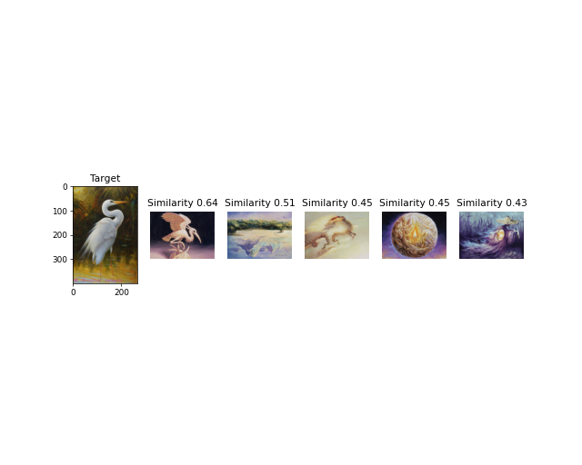
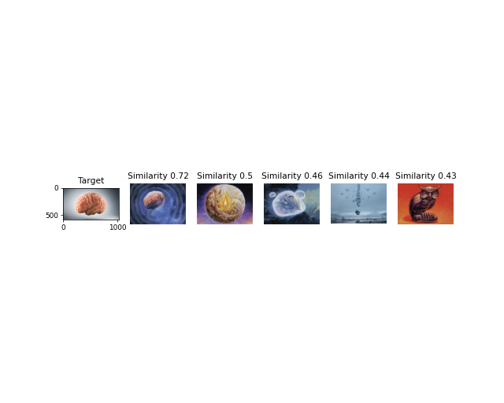
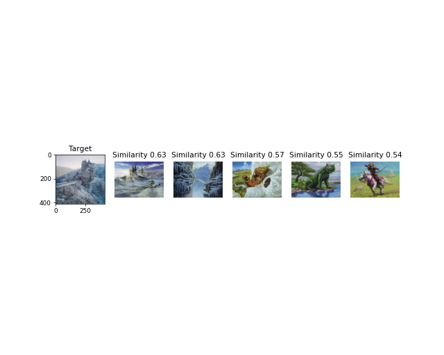

# MTG CLIP
**WORK IN PROGRESS**
This repo uses CLIP in order to detect similar images.

## How to install:
1. Run 'get_dataset.py' with yout favourite editions and get images
2. Run 'trainer.py' to train the model
3. Run 'predictor.py' with you image.

## Files and folders
- **dataset**: where the images are stored (output get_dataset.py)
- **embeddings**: where the images embeddings are stored (output trainer.py)
- **images**: where input images and results are stored (output predictor.py)
- **pca.npz**: binary file that describes the PCA used to reduce feature in model, needed for inference (output of imgebeddings model)

## Results:

## IMPORTANT:
This repo needs Tensorflow, Pytorch or Flax installed.

## TODO:
[ ] docker
[ ] API
[ ] Benchmark
[ ] fix predictor output